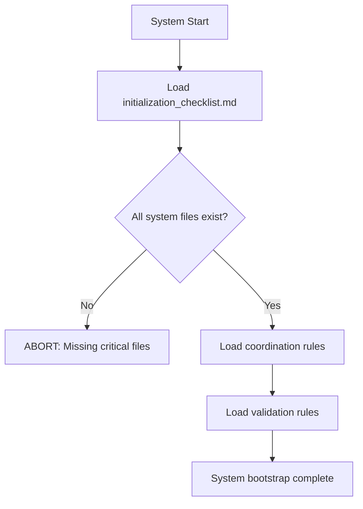
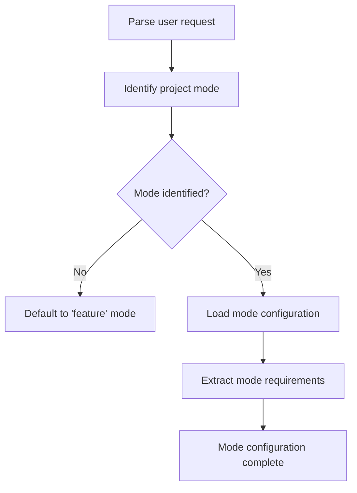
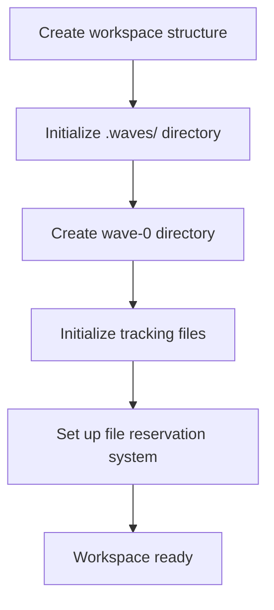
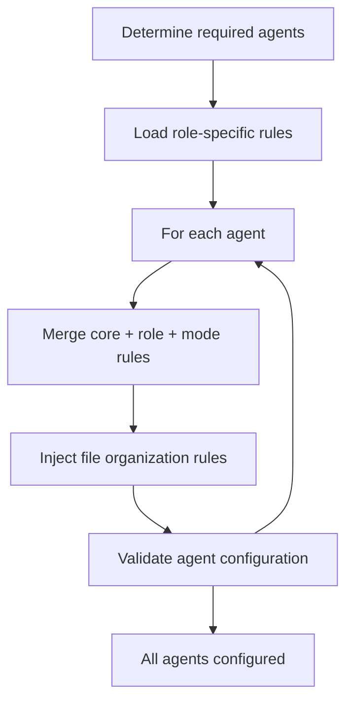
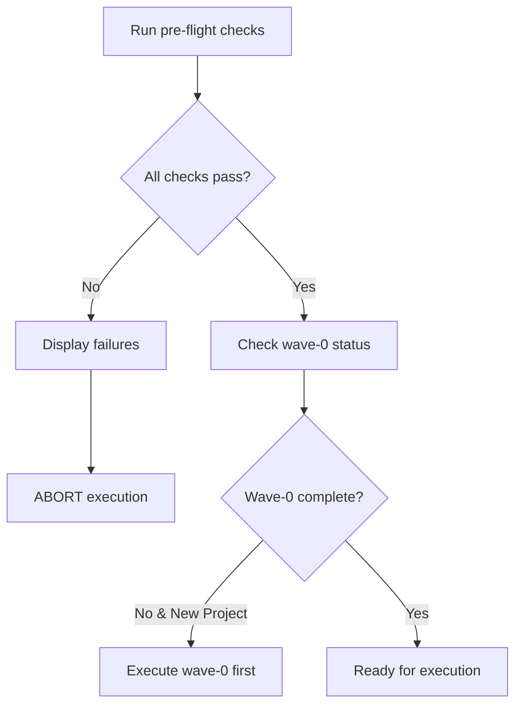
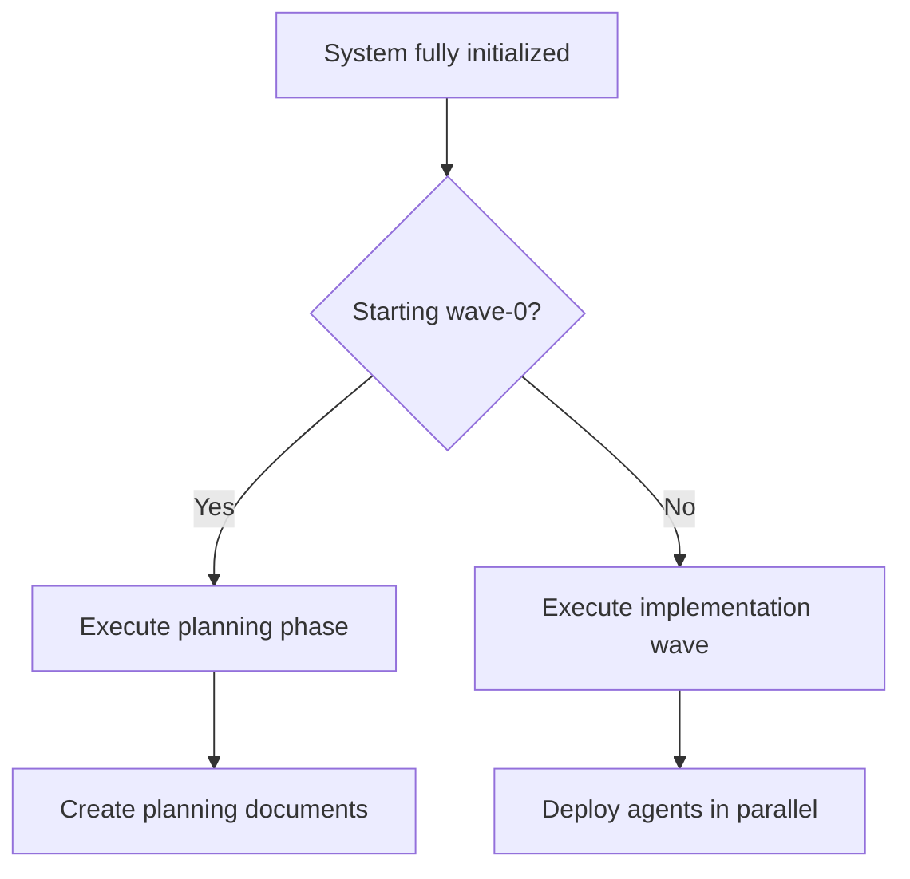

<!--
COPYRIGHT NOTICE: This file is proprietary to Ignis AI Labs LLC.
Unauthorized access, use, or distribution is strictly prohibited.
See LICENSE-PROPRIETARY.md for full terms.
-->

# Shadow Clone System Initialization Sequence

## 🎯 Purpose

This document provides the EXACT initialization sequence that MUST be followed for every Shadow Clone execution. Missing ANY step results in system failure.

## 📋 Quick Reference Checklist

```
□ 1. Load initialization_checklist.md
□ 2. Verify ALL system files exist
□ 3. Load core_agent_rules.md
□ 4. Load file_organization_rules.md
□ 5. Load wave_coordination.md
□ 6. Load system_validation_rules.md
□ 7. Identify project mode
□ 8. Load mode configuration
□ 9. Create .waves/wave-0/ directory
□ 10. Initialize tracking files
□ 11. Load role-specific rules
□ 12. Configure all agents
□ 13. Verify wave-0 requirements
□ 14. Execute pre-flight validation
□ 15. Begin execution
```

## 🔄 Detailed Initialization Flow

### Stage 1: System Bootstrap (0-5 seconds)



**Code Implementation:**
```python
def stage_1_bootstrap():
    # STEP 1: Load the checklist itself
    checklist = load_mandatory_file(".shadow/coordination_rules/initialization_checklist.md")
    
    # STEP 2: Verify system integrity
    missing_files = verify_system_files([
        ".shadow/agent_rules/core_agent_rules.md",
        ".shadow/coordination_rules/file_organization_rules.md",
        ".shadow/coordination_rules/wave_coordination.md",
        ".shadow/coordination_rules/system_validation_rules.md",
        ".shadow/coordination_rules/workspace_structure.md",
        # ... all other required files
    ])
    
    if missing_files:
        abort(f"CRITICAL: Missing files: {missing_files}")
    
    # STEP 3: Load core system rules
    system_rules = {
        "core": load_file(".shadow/agent_rules/core_agent_rules.md"),
        "file_org": load_file(".shadow/coordination_rules/file_organization_rules.md"),
        "wave_coord": load_file(".shadow/coordination_rules/wave_coordination.md"),
        "validation": load_file(".shadow/coordination_rules/system_validation_rules.md")
    }
    
    return system_rules
```

### Stage 2: Mode Detection & Configuration (5-10 seconds)



**Code Implementation:**
```python
def stage_2_mode_configuration(user_request):
    # STEP 4: Detect mode from request
    mode = detect_mode(user_request)  # Returns: feature|debug|refactor|optimize|audit|research|plan
    
    # STEP 5: Load mode-specific configuration
    mode_config = load_file(f".shadow/mode_configs/shadow-clone-{mode}.md")
    
    # STEP 6: Extract wave-0 requirements for this mode
    wave_0_requirements = extract_wave_0_requirements(mode_config)
    
    return {
        "mode": mode,
        "config": mode_config,
        "wave_0_reqs": wave_0_requirements
    }
```

### Stage 3: Workspace Preparation (10-15 seconds)



**Code Implementation:**
```python
def stage_3_workspace_preparation():
    # STEP 7: Create directory structure
    create_directory(".waves/")
    create_directory(".waves/wave-0/")  # MANDATORY for all projects
    
    # STEP 8: Initialize tracking systems
    tracking_files = {
        ".waves/constitution.md": "# Project Constitution\n\nCentral coordination authority",
        ".waves/file_registry.md": "# File Registry\n\nMaster list of all project files",
        ".waves/file_reservations.md": "# File Reservations\n\nCurrent file locks",
        ".waves/agent_registry.md": "# Agent Registry\n\nAll deployed agents",
        ".waves/convergence_schedule.md": "# Convergence Schedule\n\nCoordination points"
    }
    
    for file_path, initial_content in tracking_files.items():
        if not exists(file_path):
            write_file(file_path, initial_content)
    
    return True
```

### Stage 4: Agent Configuration (15-20 seconds)



**Code Implementation:**
```python
def stage_4_agent_configuration(mode_config, system_rules):
    # STEP 9: Determine which agents needed
    required_agents = determine_agents_for_mode(mode_config)
    
    # STEP 10: Configure each agent
    configured_agents = []
    for agent_spec in required_agents:
        # Load role-specific rules
        role_rules = load_file(f".shadow/agent_rules/{agent_spec['role']}_agent_rules.md")
        
        # Merge all applicable rules
        agent_config = {
            "name": agent_spec['name'],
            "role": agent_spec['role'],
            "rules": merge_rules(
                system_rules['core'],
                role_rules,
                mode_config,
                system_rules['file_org'],
                system_rules['wave_coord']
            ),
            "wave_0_aware": True,
            "file_org_compliant": True
        }
        
        # Validate configuration
        if not validate_agent_config(agent_config):
            abort(f"Agent {agent_spec['name']} configuration invalid")
        
        configured_agents.append(agent_config)
    
    return configured_agents
```

### Stage 5: Pre-Execution Validation (20-25 seconds)



**Code Implementation:**
```python
def stage_5_pre_execution_validation(configured_agents):
    # STEP 11: Run comprehensive pre-flight checks
    pre_flight_results = {
        "system_initialized": all_system_rules_loaded(),
        "agents_configured": len(configured_agents) > 0,
        "workspace_ready": workspace_structure_valid(),
        "tracking_active": tracking_files_initialized(),
        "wave_0_ready": wave_0_directory_exists()
    }
    
    failures = [k for k, v in pre_flight_results.items() if not v]
    if failures:
        abort(f"Pre-flight validation failed: {failures}")
    
    # STEP 12: Check wave-0 completion
    if is_new_project() and not wave_0_complete():
        log("Wave-0 planning required before implementation")
        return "EXECUTE_WAVE_0_FIRST"
    
    return "READY_FOR_EXECUTION"
```

### Stage 6: Execution Start (25+ seconds)



## 🚨 Common Initialization Failures

### 1. Missing System Files
**Error**: "CRITICAL: Missing required system file: {filename}"
**Cause**: Shadow Clone installation incomplete
**Fix**: Verify all .shadow/ directories and files exist

### 2. Mode Detection Failure
**Error**: "Unable to determine project mode"
**Cause**: Ambiguous user request
**Fix**: Explicitly specify mode in request

### 3. Wave-0 Not Complete
**Error**: "Wave-0 incomplete but attempting wave-1"
**Cause**: Trying to skip planning phase
**Fix**: Complete wave-0 planning first

### 4. Agent Configuration Invalid
**Error**: "Agent missing required rules"
**Cause**: Incomplete rule loading
**Fix**: Verify all rule files accessible

## 📊 Initialization Timing

| Stage | Duration | Critical Path |
|-------|----------|---------------|
| System Bootstrap | 0-5 sec | YES |
| Mode Configuration | 5-10 sec | YES |
| Workspace Prep | 10-15 sec | YES |
| Agent Config | 15-20 sec | YES |
| Validation | 20-25 sec | YES |
| **TOTAL** | **~25 seconds** | - |

## 🔒 Security Checkpoints

1. **File Integrity**: Verify no system files modified
2. **Rule Injection**: Ensure all agents get security rules
3. **Workspace Isolation**: Check no cross-project contamination
4. **Validation Active**: Confirm continuous validation enabled

## 💡 Best Practices

1. **Never Skip Steps**: Each step depends on previous ones
2. **Log Everything**: Detailed logs help diagnose failures
3. **Fail Fast**: Abort immediately on critical errors
4. **Validate Continuously**: Don't just check once
5. **Document Issues**: Help improve the system

## 🎬 Example: Complete Initialization

```python
def initialize_shadow_clone():
    """
    Complete Shadow Clone initialization sequence
    """
    try:
        # Stage 1: Bootstrap
        log("Stage 1: System Bootstrap...")
        system_rules = stage_1_bootstrap()
        log("✓ System bootstrap complete")
        
        # Stage 2: Mode Configuration  
        log("Stage 2: Mode Configuration...")
        mode_info = stage_2_mode_configuration(user_request)
        log(f"✓ Mode configured: {mode_info['mode']}")
        
        # Stage 3: Workspace
        log("Stage 3: Workspace Preparation...")
        stage_3_workspace_preparation()
        log("✓ Workspace ready")
        
        # Stage 4: Agents
        log("Stage 4: Agent Configuration...")
        agents = stage_4_agent_configuration(mode_info['config'], system_rules)
        log(f"✓ {len(agents)} agents configured")
        
        # Stage 5: Validation
        log("Stage 5: Pre-Execution Validation...")
        status = stage_5_pre_execution_validation(agents)
        log(f"✓ Validation complete: {status}")
        
        # Stage 6: Ready
        log("INITIALIZATION COMPLETE - System ready for execution")
        return {
            "status": "READY",
            "mode": mode_info['mode'],
            "agents": agents,
            "next_action": status
        }
        
    except Exception as e:
        log(f"INITIALIZATION FAILED: {e}")
        raise
```

## Summary

The Shadow Clone initialization sequence ensures:
- ✅ ALL system components loaded
- ✅ NO rules or validations skipped  
- ✅ Wave-0 planning enforced
- ✅ Agents properly configured
- ✅ Continuous validation active

**Remember**: Initialization is the foundation - get it right or everything fails!